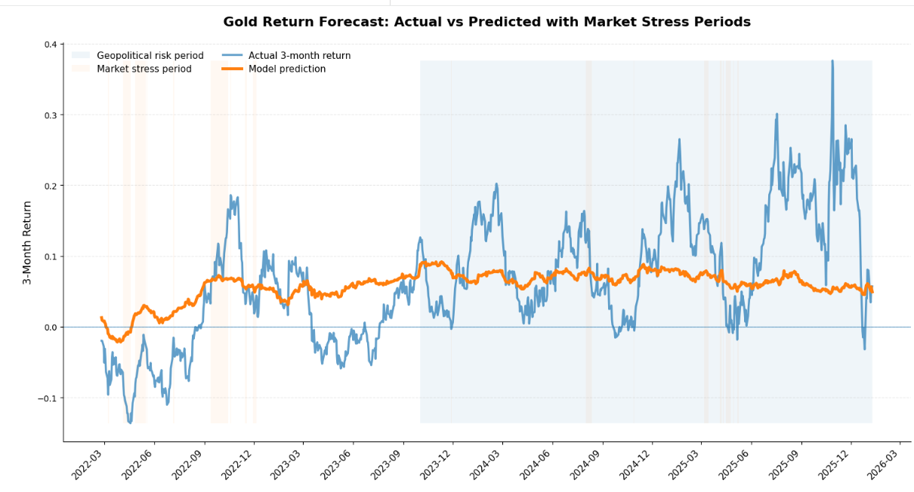

# Forecasting-of-3-Month-Gold-Returns
Machine Learning-Based Forecasting of 3-Month Gold Returns Using Macroeconomic and Geopolitical Data.

## Overview
This project analyzes whether macroeconomic and geopolitical factors can predict future gold returns.

A full machine learning pipeline is implemented, including:
, feature engineering  
, time-series modeling  
, model comparison  
, AutoML benchmarking  

## Example Output

Model predictions vs actual gold returns with highlighted market stress periods.

## Feature Importance

